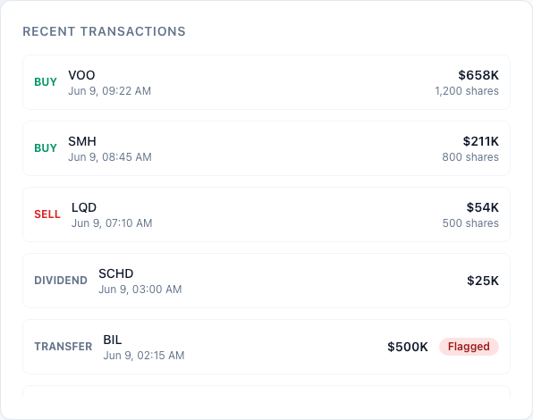
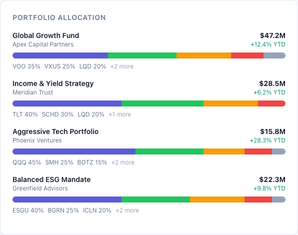
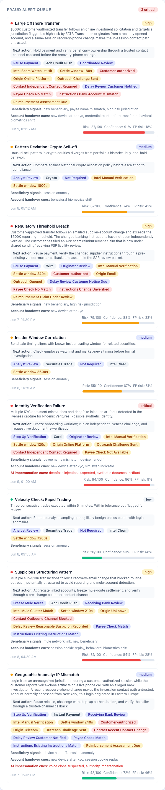
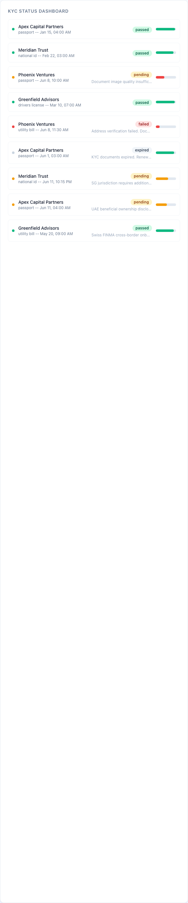
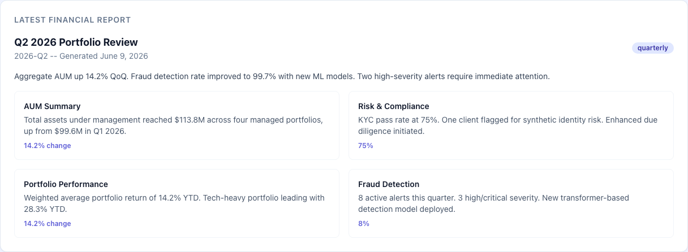
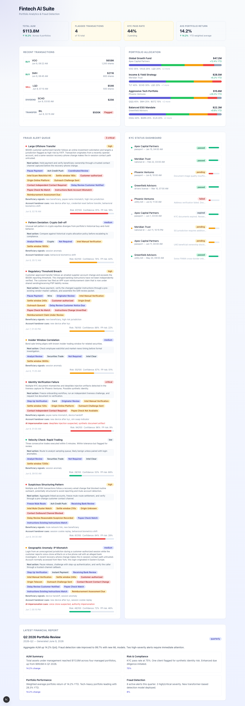

# Fintech AI Suite

**Portfolio Analytics. Fraud Detection. KYC Automation. Financial Reporting.**

A production-grade financial services dashboard built with Next.js, React 19, and TypeScript. Designed for wealth management firms, compliance teams, and fintech operations that need real-time visibility into portfolio health, transaction integrity, and regulatory standing.

## The Problem

Financial institutions operate in a high-stakes environment where three critical challenges converge:

- **Portfolio blind spots.** Advisors and analysts lack consolidated views across multiple portfolios. Asset allocation drift, performance outliers, and concentration risks go unnoticed until quarterly reviews -- costing firms both returns and client trust.
- **Fraud at scale.** Transaction volumes make manual review impossible. Suspicious patterns, structuring attempts, and geographic anomalies slip through legacy rule-based systems. The average fraud event costs $42,000 and takes 90 days to detect.
- **KYC friction.** Onboarding and periodic reviews are slow, error-prone, and inconsistent. Document verification backlogs delay time-to-revenue. Expired checks create regulatory exposure that auditors penalize.

## What Fintech AI Suite Does

A unified dashboard that surfaces what matters:

- **Hero metrics** for AUM, flagged transaction rate, KYC pass rate, and portfolio returns -- giving leadership an instant pulse check.
- **Transaction feed** with fraud flags, severity indicators, and risk scores so compliance teams triage by priority, not by volume.
- **Portfolio allocation breakdown** with color-coded composition bars across all managed portfolios.
- **Fraud alert queue** ranked by severity (critical / high / medium / low) with investigation status and risk progress bars.
- **KYC status dashboard** tracking document submissions, verification scores, and expiration dates across all clients.
- **Financial report preview** with quarterly summaries, section highlights, and key metrics.

## Tech Stack

| Layer | Technology |
|---|---|
| Framework | Next.js 15 (App Router) |
| Language | TypeScript (strict mode) |
| UI | React 19, Tailwind CSS |
| Data | Static demo data (15 transactions, 8 fraud alerts, 6 KYC checks, 4 portfolios) |
| Testing | Vitest with 10 assertion-based tests |
| Linting | ESLint (next/core-web-vitals + next/typescript) |
| Type Checking | tsc --noEmit |

## Getting Started

```bash
# Install dependencies
npm install

# Start development server
npm run dev

# Run tests
npm run test

# Run type checker
npm run typecheck

# Run linter
npm run lint

# Production build
npm run build
```

## Project Structure

```
fintech-ai-suite/
├── src/
│   ├── app/
│   │   ├── globals.css          # Tailwind + design tokens
│   │   ├── layout.tsx           # Root layout with metadata
│   │   └── page.tsx             # Dashboard page
│   ├── components/ui/
│   │   ├── badge.tsx            # Badge (default, success, warning, danger, info)
│   │   ├── card.tsx             # Card with optional title and action
│   │   ├── progress-bar.tsx     # Progress bar (accent, success, warning, danger)
│   │   ├── stat-card.tsx        # Stat card with label, value, trend, variant
│   │   └── status-dot.tsx       # Status indicator dot
│   └── lib/
│       ├── types.ts             # TypeScript interfaces for all data models
│       └── demo-data.ts         # Static demo data (portfolios, transactions, etc.)
├── tests/
│   └── fintech.test.ts          # 10 Vitest assertions
├── tailwind.config.ts
├── tsconfig.json
├── vitest.config.ts
├── eslint.config.mjs
├── next.config.ts
└── package.json
```

## Data Models

### Portfolio
Represents a managed investment portfolio with AUM, returns, risk score, and asset allocations.

### Transaction
A trade or transfer event linked to a portfolio. Includes type (buy/sell/transfer/dividend), amount, price, and an optional fraud flag with reason.

### FraudAlert
An AI-detected anomaly with severity (low/medium/high/critical), risk score (0-100), investigation status, and category (anomaly/aml/identity/velocity/geographic).

### KYCCheck
A know-your-customer verification record with document type, submission/verification timestamps, verification score, and status (passed/pending/failed/expired).

### FinancialReport
A periodic report (monthly/quarterly/annual) with structured sections and a summary.

### FintechMetrics
Aggregated dashboard metrics: total AUM, flagged transaction count, KYC pass rate, average portfolio return, active fraud alerts, and critical alert count.

## Screenshots

| Screenshot | Caption |
|---|---|
|  | Recent transactions with amounts and fraud flags |
|  | Portfolio allocation with AUM and year-to-date returns |
|  | Fraud alert queue with severity and intervention actions |
|  | KYC status dashboard with review and compliance states |
|  | Latest financial report with portfolio analytics |
|  | Full-page portfolio demo screenshot |

## Demo Data Summary

| Dataset | Count | Details |
|---|---|---|
| Portfolios | 4 | Global Growth ($47.2M), Income Yield ($28.5M), Aggressive Tech ($15.8M), Balanced ESG ($22.3M) |
| Transactions | 15 | Mix of buys, sells, transfers, and dividends; 4 flagged for review |
| Fraud Alerts | 8 | 1 critical, 3 high, 3 medium, 1 low |
| KYC Checks | 6 | 3 passed, 1 pending, 1 failed, 1 expired |
| Financial Reports | 1 | Q2 2026 quarterly review with 4 sections |

## License

Proprietary. All rights reserved.
